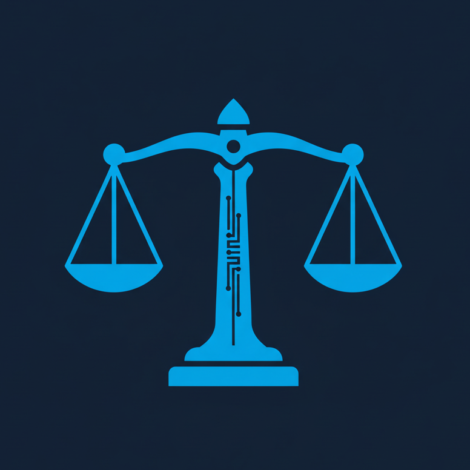

<div align="center">

  

  # ⚖️ AuroraLex Suite

  **Yapay Zeka Destekli Yeni Nesil Hukuk Asistanı**
  
  **Next-Gen AI-Powered Legal Assistant**

  [](https://flutter.dev)
  [](https://dart.dev)
  [](https://firebase.google.com)
  [](https://deepmind.google/technologies/gemini/)
  [](LICENSE)

  <p align="center">
    <a href="#-özellikler--features">Özellikler</a> •
    <a href="#-teknolojiler--tech-stack">Teknolojiler</a> •
    <a href="#-kurulum--installation">Kurulum</a> •
    <a href="#-ekran-görüntüleri--screenshots">Görseller</a>
  </p>
</div>

---

## 🌟 Proje Hakkında / About

**AuroraLex Suite**, hukuk profesyonellerinin iş yükünü hafifletmek ve verimliliğini artırmak için tasarlanmış, **Google Gemini AI** destekli kapsamlı bir mobil asistan uygulamasıdır. Geleneksel hukuk uygulamalarının ötesine geçerek, yapay zeka tabanlı danışmanlık, akıllı dava takibi ve güvenli doküman yönetimini tek bir modern arayüzde sunar.

**AuroraLex Suite** is a comprehensive mobile assistant designed to reduce the workload and increase the efficiency of legal professionals, powered by **Google Gemini AI**. Going beyond traditional legal apps, it offers AI-based consultation, smart case tracking, and secure document management in a single modern interface.

---

## 🚀 Özellikler / Features

### 🤖 AI Hukuki Danışman (AI Legal Advisor)
> *Sizin için araştıran, analiz eden ve özetleyen akıllı asistan.*
*   **Türk Hukuku Uzmanı**: Anayasa, TCK, CMK ve TMK mevzuatına hakim.
*   **Akademik Analiz**: Kanun maddelerine dayalı, detaylı hukuki yorumlar.
*   **Bağlam Hafızası**: Önceki konuşmaları hatırlayan kesintisiz sohbet deneyimi.

### 📁 Akıllı Dava Takibi (Smart Case Tracker)
*   **Dava Yönetimi**: Tüm davalarınızın detaylı takibi ve durum yönetimi.
*   **Takvim & Hatırlatıcı**: Duruşma günlerini asla kaçırmayın.
*   **Doküman Kasası**: Dava dosyalarınızı güvenle saklayın ve kategorize edin.

### 📚 İnteraktif Hukuk Sözlüğü (Legal Dictionary)
*   **Çift Dil**: Türkçe ve İngilizce 48+ temel hukuki terim.
*   **Kategorik Erişim**: Ceza, Medeni, Ticaret hukuku gibi alanlara göre filtreleme.
*   **Örnekli Anlatım**: Her terim için pratik kullanım senaryoları.

### 🔐 Üst Düzey Güvenlik (High Security)
*   **Biyometrik Giriş**: Parmak izi ve yüz tanıma (FaceID/TouchID).
*   **Bulut Güvenliği**: Firebase Authentication ile korunan veriler.
*   **Gizlilik Odaklı**: Kişisel verileriniz güvende.

---

## 🛠️ Teknolojiler / Tech Stack

| Alan | Teknoloji | Detay |
|------|-----------|-------|
| **Frontend** |  | Material Design 3, Responsive UI |
| **Language** |  | Null Safety, Async/Await |
| **Backend** |  | Auth, Firestore, Storage, Functions |
| **AI Model** |  | Google Generative AI SDK |
| **State Mng.** |  | Hooks Riverpod |
| **Routing** |  | Declarative Routing |

---

## 📱 Kurulum / Installation

Projeyi yerel ortamınızda çalıştırmak için aşağıdaki adımları izleyin:

### 1. Projeyi Klonlayın
```bash
git clone https://github.com/MANOROMAN/AuroraLex-Suite.git
cd AuroraLex-Suite
```

### 2. Bağımlılıkları Yükleyin
```bash
flutter pub get
```

### 3. API Anahtarlarını Ayarlayın
Güvenlik nedeniyle API anahtarları repoda bulunmamaktadır. Aşağıdaki dosyalarda ilgili yerleri kendi anahtarlarınızla güncelleyin:

*   `lib/src/services/ai_service.dart`:
    ```dart
    _apiKey = 'YOUR_GEMINI_API_KEY';
    ```
*   `lib/src/core/config/firebase_options.dart`:
    ```dart
    apiKey: 'YOUR_FIREBASE_API_KEY',
    ```

### 4. Uygulamayı Başlatın
```bash
flutter run
```

---

## 📂 Proje Yapısı / Project Structure

```
lib/
├── src/
│   ├── core/            # Yapılandırma, Sabitler, Tema
│   ├── features/        # Özellik Bazlı Modüller (Auth, Dashboard, vb.)
│   ├── services/        # API ve Backend Servisleri
│   ├── widgets/         # Yeniden Kullanılabilir Widget'lar
│   └── app.dart         # Ana Uygulama Widget'ı
└── main.dart            # Başlangıç Noktası
```

---

## ⚠️ Yasal Uyarı / Disclaimer

*Bu uygulama, hukuk profesyonellerine yardımcı olmak amacıyla geliştirilmiş bir araçtır. Yapay zeka tarafından üretilen içerikler tavsiye niteliğindedir ve profesyonel hukuki danışmanlık yerine geçmez. Kritik kararlar almadan önce mutlaka yetkili bir hukukçuya danışınız.*

---

<div align="center">

  **Developed with ❤️ by AuroraLex Team**
  
  [](https://github.com/MANOROMAN)

</div>
